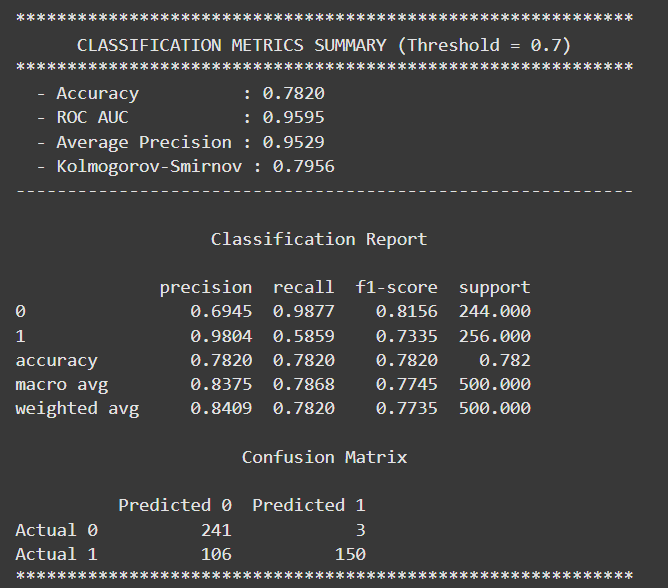
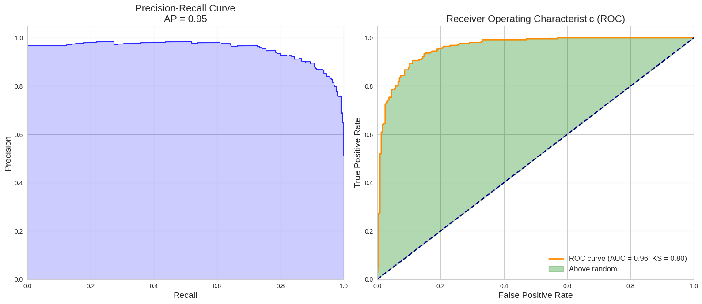
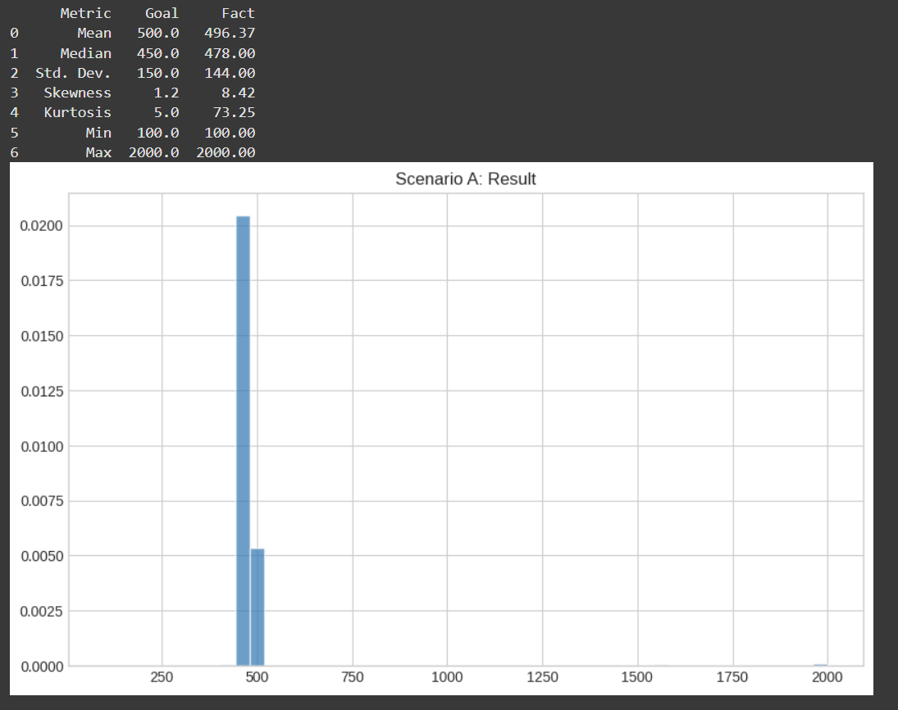
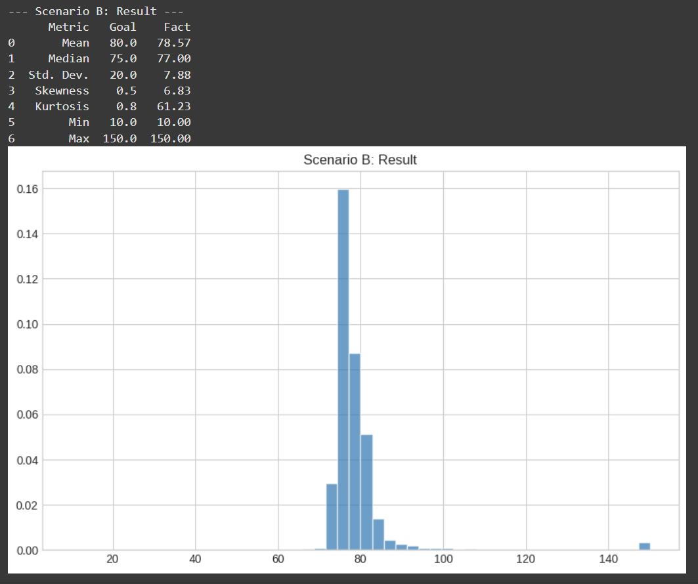
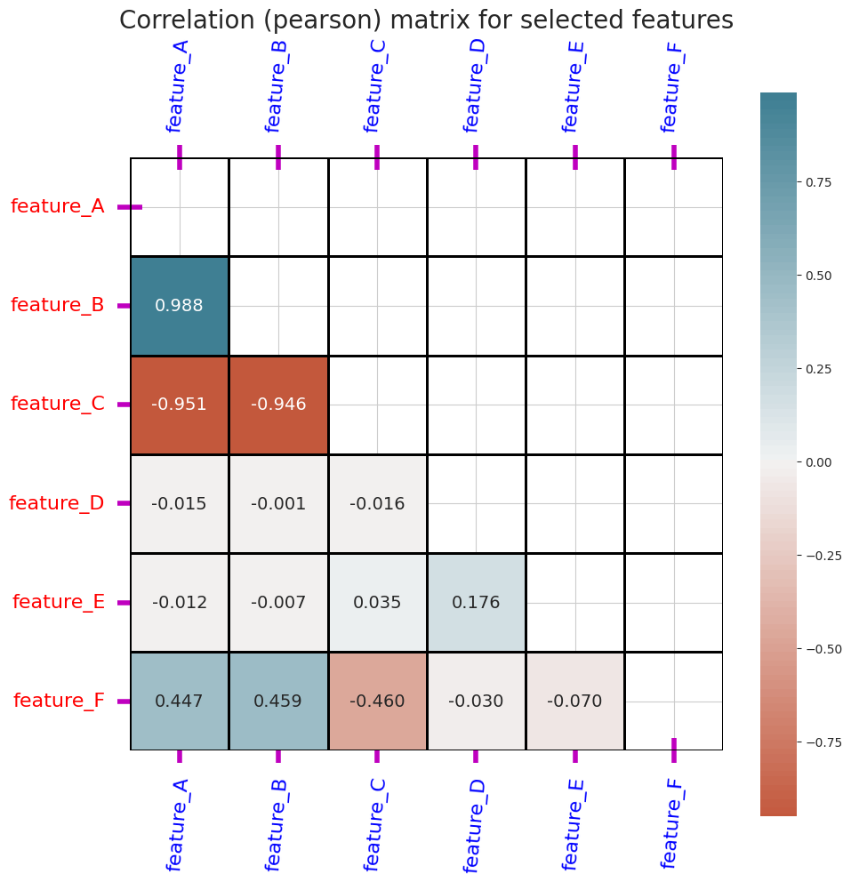
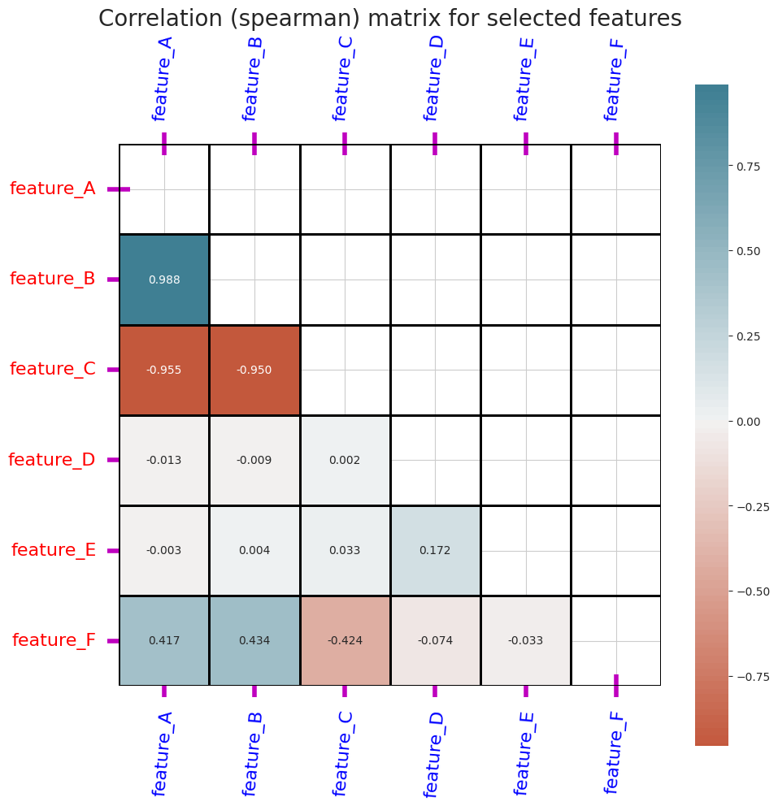
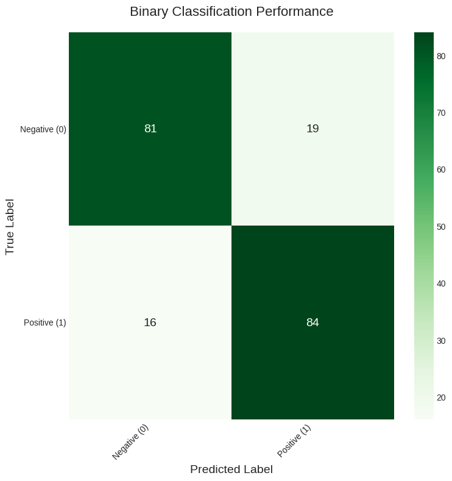
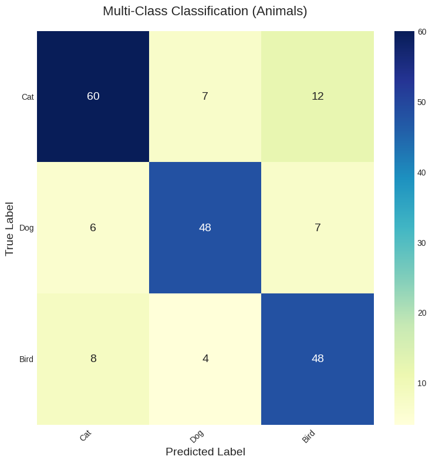

# DSTools: Data Science Research Toolkit

[](https://github.com/s-kav/ds_tools/actions)
[](https://pypi.org/project/dscience-tools/)
[](https://codecov.io/gh/s-kav/ds_tools)
[](https://opensource.org/licenses/MIT)
[](https://pepy.tech/projects/dscience-tools)
[](https://github.com/psf/black)


# Table of Contents

*   [Short intro](#short-intro)
*   [Key Features](#key-features)
*   [Installation](#installation)
*   [Function Overview](#function-overview)
*   [Examples of usage](#examples-of-usage)
*   [Available Tools](#available-tools)
*   [Authors](#authors)
*   [Contributing](#contributing)
*   [References](#references)
*   [License](#license)


# Short intro

**DSTools** is a Python library designed to assist data scientists and researchers by providing a collection of helpful functions for various stages of a data science project, from data exploration and preprocessing to model evaluation and synthetic data generation.

The library is built upon the author's extensive multi-decade experience (30+ years) in data science, statistical modeling, and enterprise software development. Drawing from real-world challenges encountered across diverse industries including finance, banking, healthcare, insurance, and e-commerce, this toolkit addresses common pain points that practitioners face daily in their analytical workflows.

The development philosophy emphasizes practical utility over theoretical complexity, incorporating battle-tested patterns and methodologies that have proven effective in production environments. Each function and module reflects lessons learned from managing large-scale data projects, optimizing computational performance, and ensuring code maintainability in collaborative team settings.

The library encapsulates best practices developed through years of consulting work, academic research collaborations, and hands-on problem-solving in high-stakes business environments. It represents a distillation of proven techniques, streamlined workflows, and robust error-handling approaches that have evolved through countless iterations and real-world applications.

This comprehensive toolkit serves as a bridge between theoretical data science concepts and practical implementation needs, offering developers and researchers a reliable foundation built on decades of field-tested expertise and continuous refinement based on community feedback and emerging industry requirements. This library with helper functions to accelerate and simplify various stages of the data science research cycle.

This toolkit is built on top of popular libraries like Pandas, Polars, Scikit-learn, Optuna, and Matplotlib, providing a higher-level API for common tasks in Exploratory Data Analysis (EDA), feature preprocessing, model evaluation, and synthetic data generation. It is designed for data scientists, analysts, and researchers who want to write cleaner, more efficient, and more reproducible code.


# Key Features

-   **Advanced Data Analysis:** Get quick and detailed statistics for numerical and categorical columns.
-   **Powerful Visualizations:** Generate insightful correlation matrices and confusion matrices with a single function call.
-   **Comprehensive Model Evaluation:** Calculate a wide range of classification metrics and visualize performance curves effortlessly.
-   **Synthetic Data Generation:** Create datasets with specific statistical properties (mean, median, std, skew, kurtosis) for robust testing and simulation. Create complex numerical distributions matching specific statistical moments (`generate_distribution`, `generate_distribution_from_metrics`).
-   **Efficient Preprocessing:** Encode categorical variables, handle outliers, and create features from missing values.
-   **Utility Functions:** A collection of helpers for stationarity testing, data validation, and file I/O operations.
-   **Data Exploration:** Quickly get statistics for numerical and categorical features (`describe_numeric`, `describe_categorical`), check for missing values (`check_NINF`), and visualize correlations (`corr_matrix`).
-   **Model Evaluation:** Comprehensive classification model evaluation (`evaluate_classification`, `compute_metrics`) with clear visualizations (`plot_confusion_matrix`).
-   **Data Preprocessing:** Encode categorical variables (`labeling`), handle outliers (`remove_outliers_iqr`), and scale features (`min_max_scale`).
-   **Time Series Analysis:** Test for stationarity using the Dickey-Fuller test (`test_stationarity`).
-   **Advanced Statistics:** Calculate non-parametric correlation (`chatterjee_correlation`), entropy, and KL-divergence.
-   **Utilities:** Save/load DataFrames to/from ZIP archives, generate random alphanumeric codes, and more.


# Installation

## Clone the Repository

```bash
git clone https://github.com/s-kav/ds_tools.git

```
or

Install `dscience-tools` directly from PyPI:

```bash
pip install dscience-tools
```

## Navigate to the Project Directory

```bash
cd ds_tools

```

## Install Dependencies

Ensure you have Python version 3.8 or higher and install the required packages:

```bash
pip install -r requirements.txt

```

# Function Overview

The library provides a wide range of functions. To see a full, formatted list of available tools, you can use the function_list method:

```python

from ds_tools import DSTools

tools = DSTools()
tools.function_list()

```

# Examples of usage

Here're some simple examples of how to use this library.

## Evaluate a classification model.

Tired of writing boilerplate code to see your model's performance? Use `evaluate_classification` for a complete summary.

```python

import numpy as np
from ds_tools import DSTools

# 1. Initialize the toolkit
tools = DSTools()

# 2. Generate some dummy data
y_true = np.array([0, 1, 1, 0, 1, 0, 0, 1])
y_probs = np.array([0.1, 0.8, 0.6, 0.3, 0.9, 0.2, 0.4, 0.7])

# 3. Get a comprehensive evaluation report
# This will print metrics and show plots for ROC and Precision-Recall curves.
results = tools.evaluate_classification(true_labels=y_true, pred_probs=y_probs)

# The results are also returned as a dictionary
print(f"\nROC AUC Score: {results['roc_auc']:.4f}")

```

This will produce:
- A detailed printout of key metrics (Accuracy, ROC AUC, Average Precision, etc.).
- A full classification report.
- A confusion matrix.
- Beautifully plotted ROC and Precision-Recall curves.

**Example of classification metrics, report, and confusion matrix (at threshold = 0.7)**


**Example of precision vs recall and ROC (TPR vs FPR) curves**


**Example of classification metrics, report, and confusion matrix (at threshold = 0.5, for comparison)**


## Generating a Synthetic Distribution.

Need to create a dataset with specific statistical properties? - generate_distribution_from_metrics can do that.

```python

from ds_tools import DSTools, DistributionConfig

tools = DSTools()

# Define the desired metrics
metrics_config = DistributionConfig(
    mean=1042,
    median=330,
    std=1500,
    min_val=1,
    max_val=120000,
    skewness=13.2,
    kurtosis=245, # Excess kurtosis
    n=10000
)

# Generate the data
generated_data = tools.generate_distribution_from_metrics(n=10000, metrics=metrics_config)

print(f"Generated Mean: {np.mean(generated_data):.2f}")
print(f"Generated Std: {np.std(generated_data):.2f}")

```

**Comparative analysis of target statistical parameters against actual generated data results (scenario A)**


**Comparative analysis of target statistical parameters against actual generated data results (scenario B)**



## Correlation Matrix Heatmap

Visualize the relationships in your data with a highly customizable correlation matrix.

```python
# --- Sample Data ---
data = {
    'feature_a': np.random.rand(100) * 100,
    'feature_b': np.random.rand(100) * 50 + 25,
    'feature_c': np.random.rand(100) * -80,
}
df = pd.DataFrame(data)
df['feature_d'] = df['feature_a'] * 1.5 + np.random.normal(0, 10, 100)

# --- Generate a Spearman correlation matrix ---
config = CorrelationConfig(build_method='spearman', font_size=12)
tools.corr_matrix(df, config=config)
```

This will display a publication-quality heatmap, masked to show only the lower triangle for clarity, using the Spearman correlation method.

**Example of correlation matrix (by Pearson)**


**Example of correlation matrix (by Spearman)**



## Detailed Categorical Analysis.

Quickly understand the distribution of your categorical features.

```python
# --- Sample Data ---
data = {
    'city': ['London', 'Paris', 'London', 'New York', 'Paris', 'London'],
    'status': ['Active', 'Inactive', 'Active', 'Active', 'Inactive', 'Active']
}
df = pd.DataFrame(data)

# --- Get stats for a column ---
tools.category_stats(df, 'city')

=========================== output
           city
     uniq_names amount_values  percentage
0        London             3       50.00
1         Paris             2       33.33
2      New York             1       16.67

```

## Plot confusion matrix.

Helps to plot confusion matrix in graphical kind, especially for calssification tasks.


```python
np.random.seed(42)
N_SAMPLES = 1500

y_true_multi = np.random.randint(0, 3, size=N_SAMPLES)
correct_preds = np.random.rand(N_SAMPLES) < 0.75
y_pred_multi = np.where(correct_preds, y_true_multi, (y_true_multi + random_errors) % 3)

plot_confusion_matrix(
y_true_multi,
y_pred_multi,
class_labels=['Cat', 'Dog', 'Bird'],
title='Multi-Class Classification (Animals)',
cmap='YlGnBu'
)
```

**Example of confusion matrix plotting (for binary classification)**



**Example of confusion matrix plotting (for multiclass classification)**



Full code base for other function testing you can find [here](https://github.com/s-kav/ds_tools/blob/main/tests/).


# Available Tools

The library includes a wide range of functions. Here is a complete list:

1. compute_metrics: Calculate main pre-selected classification metrics.
2. corr_matrix: Calculate and visualize a correlation matrix.
3. category_stats: Calculate and print categorical statistics.
4. sparse_calc: Calculate sparsity level as a coefficient.
5. trials_res_df: Aggregate Optuna optimization trials into a DataFrame.
6. labeling: Encode categorical variables with optional ordering.
7. remove_outliers_iqr: Remove or cap outliers using the IQR method.
8. stat_normal_testing: Perform D'Agostino's K² test for normality.
9. test_stationarity: Perform the Dickey-Fuller test for time-series stationarity.
10. check_NINF: Check for NaN and infinite values in a DataFrame.
11. df_stats: Get a quick, comprehensive overview of a DataFrame's structure.
12. describe_categorical: Generate a detailed description of categorical columns.
13. describe_numeric: Generate a detailed description of numerical columns.
14. generate_distribution: Generate a synthetic numerical distribution with specific statistical properties.
15. evaluate_classification: A master function to calculate, print, and visualize metrics for a binary classification model.
16. grubbs_test: Perform Grubbs' test to identify a single outlier.
17. plot_confusion_matrix: Plot a clear and readable confusion matrix.
18. add_missing_value_features: Add features based on the count of missing values per row.
19. chatterjee_correlation: Calculate Chatterjee's rank correlation coefficient (Xi).
20. calculate_entropy & calculate_kl_divergence: Compute information theory metrics.
21. min_max_scale: Scale DataFrame columns to the range [0, 1].
22. save_dataframes_to_zip & read_dataframes_from_zip: Save and load multiple dataframes from a single ZIP archive.
23. generate_alphanum_codes: Generate an array of random alphanumeric codes.
24. generate_distribution_from_metrics: A powerful function to generate a synthetic distribution matching a full suite of statistical metrics.


# Authors

- [@sergiikavun](https://www.linkedin.com/in/sergii-kavun/)


# Contributing

Contributions are welcome! Please feel free to submit a pull request or open an issue on the GitHub repository. If you have ideas for new features or improvements, please open an issue first to discuss what you would like to change.

To contribute:

1. Fork the repository.
2. Create a new branch for your feature or bugfix (git checkout -b feature/AmazingFeature).
3. Make your changes.
4. Add tests for your new feature. Ensure all tests pass (pytest).
5. Format your code (black . and ruff --fix .).
6. Commit your changes with clear messages (git commit -m 'Add some AmazingFeature').
7. Push to the branch/fork (git push origin feature/AmazingFeature).
8. Open a Pull Request.

Please ensure your code adheres to PEP8 standards and includes appropriate docstrings and comments.


# References

For citing you should use:

Sergii Kavun. (2025). s-kav/ds_tools: Version 1.0.9 (v1.0.9). Zenodo. https://doi.org/10.5281/zenodo.15864146

[](https://doi.org/10.5281/zenodo.15864146)


# License

This project is licensed under the MIT License - see the [LICENSE](https://github.com/s-kav/ds_tools/blob/main/LICENSE) file for details.
