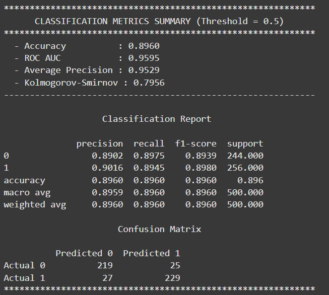
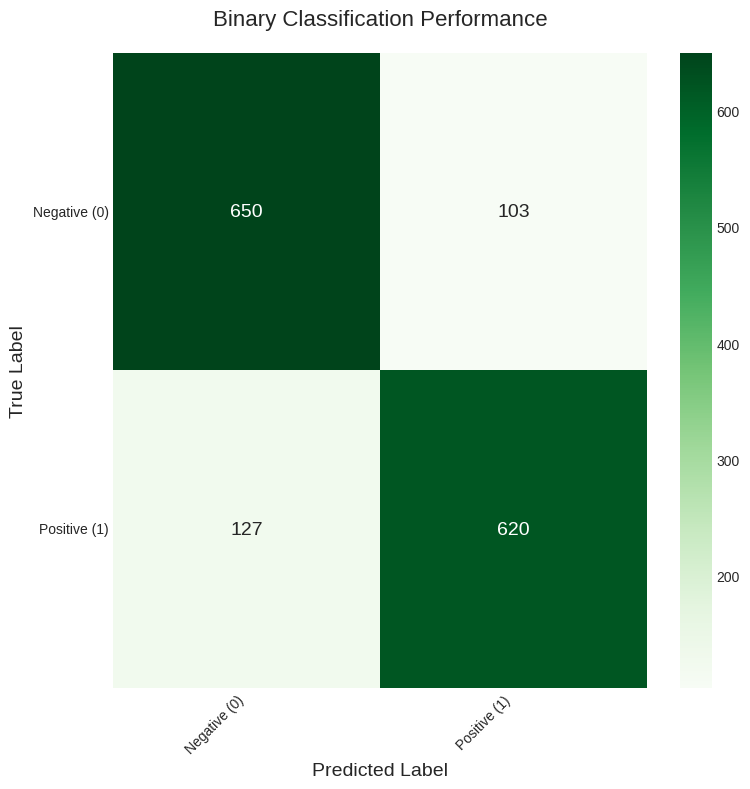
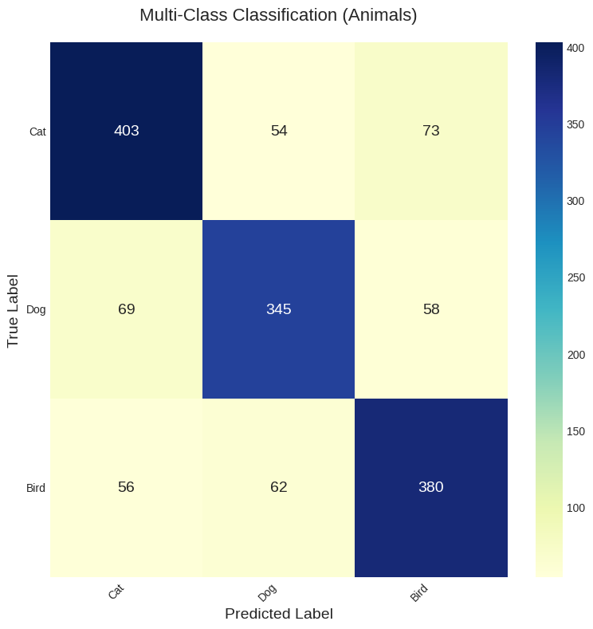

# DSTools: Data Science Research Toolkit

[](https://github.com/s-kav/ds_tools/actions)
[](https://pypi.org/project/dscience-tools/)
[](https://codecov.io/gh/s-kav/ds_tools)
[](https://polyformproject.org/licenses/noncommercial/1.0.0/)
[](https://pepy.tech/projects/dscience-tools)
[](https://github.com/psf/black)
[](https://github.com/pre-commit/pre-commit)
[](https://github.com/astral-sh/ruff)
[](https://www.python.org/dev/peps/pep-0008/)

[](https://www.python.org)
[](https://pytorch.org/)


# Table of Contents

*   [Short intro](#short-intro)
*   [Key Features](#key-features)
*   [Installation](#installation)
*   [Function Overview](#function-overview)
*   [Examples of usage](#examples-of-usage)
*   [Available Tools](#available-tools)
*   [Authors](#authors)
*   [Contributing](#contributing)
*   [TODO](#todo)
*   [References](#references)
*   [License](#license)


# Short intro

**DSTools** is a Python library designed to assist data scientists and researchers by providing a collection of helpful functions for various stages of a data science project, from data exploration and preprocessing to model evaluation and synthetic data generation.

The library is built upon the author's extensive multi-decade experience (30+ years) in data science, statistical modeling, and enterprise software development. Drawing from real-world challenges encountered across diverse industries including finance, banking, healthcare, insurance, and e-commerce, this toolkit addresses common pain points that practitioners face daily in their analytical workflows.

The development philosophy emphasizes practical utility over theoretical complexity, incorporating battle-tested patterns and methodologies that have proven effective in production environments. Each function and module reflects lessons learned from managing large-scale data projects, optimizing computational performance, and ensuring code maintainability in collaborative team settings.

The library encapsulates best practices developed through years of consulting work, academic research collaborations, and hands-on problem-solving in high-stakes business environments. It represents a distillation of proven techniques, streamlined workflows, and robust error-handling approaches that have evolved through countless iterations and real-world applications.

This comprehensive toolkit serves as a bridge between theoretical data science concepts and practical implementation needs, offering developers and researchers a reliable foundation built on decades of field-tested expertise and continuous refinement based on community feedback and emerging industry requirements. This library with helper functions to accelerate and simplify various stages of the data science research cycle.

This toolkit is built on top of popular libraries like Pandas, Polars, Scikit-learn, Optuna, and Matplotlib, providing a higher-level API for common tasks in Exploratory Data Analysis (EDA), feature preprocessing, model evaluation, and synthetic data generation. It is designed for data scientists, analysts, and researchers who want to write cleaner, more efficient, and more reproducible code.


# Key Features

-   **Advanced Data Analysis:** Get quick and detailed statistics for numerical and categorical columns.
-   **Powerful Visualizations:** Generate insightful correlation matrices and confusion matrices with a single function call.
-   **Comprehensive Model Evaluation:** Calculate a wide range of classification metrics and visualize performance curves effortlessly.
-   **Synthetic Data Generation:** Create datasets with specific statistical properties (mean, median, std, skew, kurtosis) for robust testing and simulation. Create complex numerical distributions matching specific statistical moments (`generate_distribution`, `generate_distribution_from_metrics`).
-   **Efficient Preprocessing:** Encode categorical variables, handle outliers, and create features from missing values.
-   **Utility Functions:** A collection of helpers for stationarity testing, data validation, and file I/O operations.
-   **Data Exploration:** Quickly get statistics for numerical and categorical features (`describe_numeric`, `describe_categorical`), check for missing values (`check_NINF`), and visualize correlations (`corr_matrix`).
-   **Model Evaluation:** Comprehensive classification model evaluation (`evaluate_classification`, `compute_metrics`) with clear visualizations (`plot_confusion_matrix`).
-   **Data Preprocessing:** Encode categorical variables (`labeling`), handle outliers (`remove_outliers_iqr`), and scale features (`min_max_scale`).
-   **Time Series Analysis:** Test for stationarity using the Dickey-Fuller test (`test_stationarity`).
-   **Advanced Statistics:** Calculate non-parametric correlation (`chatterjee_correlation`), entropy, and KL-divergence.
-   **Utilities:** Save/load DataFrames to/from ZIP archives, generate random alphanumeric codes, and more.

## What's New in Version 2.0.0

This version marks a major architectural refactoring of the library, focusing on modularity, performance, and advanced ML features.

-   **✨ Modular Design:** The toolkit is now re-organized into logical namespaces. Instead of a single flat API, you now access functionality through `tools.metrics`, `tools.distance`, etc.
-   **🚀 High-Performance Backends:** Major functions in `metrics` and `distance` now automatically leverage **GPU acceleration (CuPy)** and **parallel CPU execution (Numba)** for significant speedups on large datasets.
-   **🤖 Gradient Calculation:** Key loss functions (like `mse`, `mae`, `huber_loss`) can now return their gradients (`return_grad=True`), making them suitable for custom training loops in ML frameworks.
-   **📈 Training Monitoring:** A new real-time monitoring system has been added to the `metrics` module to track and plot metrics during model training.

## TODO & Future Plans

This library is actively maintained and will be expanded to cover more aspects of the daily data science workflow. The focus remains on providing high-performance, easy-to-use tools for common and resource-intensive tasks.

Here is the development roadmap:

-   [ ] **Expand Core Modules:**
    -   [ ] Add more loss and another functions and metrics to `tools.metrics` (e.g. for classification, clusterization, etc.).
    -   [ ] Implement more distance measures in `tools.distance` (e.g., Levenshtein for strings, Silhouette, etc.).
-   [ ] **New `Preprocessing` Module:**
    -   [ ] Develop high-performance feature scaling and encoding functions.
    -   [ ] Add utilities for handling time-series data.
-   [ ] **New `Visualization` Module:**
    -   [ ] Create simple wrappers around Matplotlib/Seaborn for common plots (e.g., feature distribution, ROC curves).
-   [ ] **Community & Contributions:**
    -   [ ] Improve documentation with more examples.
    -   [ ] Create contribution guidelines (`CONTRIBUTING.md`).

Your feature requests and contributions are highly encouraged! Please open an issue to suggest a new function.

# Installation

## Clone the Repository

```bash
git clone https://github.com/s-kav/ds_tools.git

```
or

Install `dscience-tools` directly from PyPI:

```bash
pip install dscience-tools
```

## Navigate to the Project Directory

```bash
cd ds_tools

```

## Install Dependencies

Ensure you have Python version 3.8 or higher and install the required packages:

```bash
pip install -r requirements.txt

```

# Function Overview

The library provides a wide range of functions. To see a full, formatted list of available tools, you can use the function_list method:

```python

from ds_tools import DSTools

tools = DSTools()
tools.function_list()

```

# Examples of usage

Here're some simple examples of how to use this library.

## Using the Metrics Module

Calculate Mean Absolute Error and its gradient. The best backend (GPU/Numba/NumPy) is chosen automatically.

```python

import numpy as np

y_true = np.array()
y_pred = np.array([1.1, 2.2, 2.8, 4.3])

# Calculate only the loss value
mae_loss = tools.metrics.mae(y_true, y_pred)
print(f"MAE Loss: {mae_loss:.4f}")

# Calculate both loss and its gradient
loss, grad = tools.metrics.mae(y_true, y_pred, return_grad=True)
print(f"Gradient: {grad}")
```

## Using the Distance Module

```python
u = np.array()
v = np.array()

euc_dist = tools.distance.euclidean(u, v)
print(f"Euclidean Distance: {euc_dist:.4f}")
```

## Real-time Training Monitoring

```python
# 1. Start monitoring
tools.metrics.start_monitoring()

# 2. Simulate training loop
for epoch in range(10):
    # Dummy loss values
    loss = 1 / (epoch + 1)
    val_loss = 1.2 / (epoch + 1) + np.random.rand() * 0.1
    
    # Update history at the end of each epoch
    tools.metrics.update(epoch, logs={'loss': loss, 'val_loss': val_loss})

# 3. Get history as a DataFrame or plot it
history_df = tools.metrics.get_history_df()
print(history_df)

tools.metrics.plot_history()
```

## Evaluate a classification model.

Tired of writing boilerplate code to see your model's performance? Use `evaluate_classification` for a complete summary.

```python

import numpy as np
from ds_tools import DSTools

# 1. Initialize the toolkit
tools = DSTools()

# 2. Generate some dummy data
y_true = np.array([0, 1, 1, 0, 1, 0, 0, 1])
y_probs = np.array([0.1, 0.8, 0.6, 0.3, 0.9, 0.2, 0.4, 0.7])

# 3. Get a comprehensive evaluation report
# This will print metrics and show plots for ROC and Precision-Recall curves.
results = tools.evaluate_classification(true_labels=y_true, pred_probs=y_probs)

# The results are also returned as a dictionary
print(f"\nROC AUC Score: {results['roc_auc']:.4f}")

```

This will produce:
- A detailed printout of key metrics (Accuracy, ROC AUC, Average Precision, etc.).
- A full classification report.
- A confusion matrix.
- Beautifully plotted ROC and Precision-Recall curves.

**Example of classification metrics, report, and confusion matrix (at threshold = 0.7)**


**Example of precision vs recall and ROC (TPR vs FPR) curves**


**Example of classification metrics, report, and confusion matrix (at threshold = 0.5, for comparison)**


## Generating a Synthetic Distribution.

Need to create a dataset with specific statistical properties? - generate_distribution_from_metrics can do that.

```python

from ds_tools import DSTools, DistributionConfig

tools = DSTools()

# Define the desired metrics
metrics_config = DistributionConfig(
    mean=1042,
    median=330,
    std=1500,
    min_val=1,
    max_val=120000,
    skewness=13.2,
    kurtosis=245, # Excess kurtosis
    n=10000
)

# Generate the data
generated_data = tools.generate_distribution_from_metrics(n=10000, metrics=metrics_config)

print(f"Generated Mean: {np.mean(generated_data):.2f}")
print(f"Generated Std: {np.std(generated_data):.2f}")

```

**Comparative analysis of target statistical parameters against actual generated data results (scenario A)**


**Comparative analysis of target statistical parameters against actual generated data results (scenario B)**


## Correlation Matrix Heatmap

Visualize the relationships in your data with a highly customizable correlation matrix.

```python
# --- Sample Data ---
data = {
    'feature_a': np.random.rand(100) * 100,
    'feature_b': np.random.rand(100) * 50 + 25,
    'feature_c': np.random.rand(100) * -80,
}
df = pd.DataFrame(data)
df['feature_d'] = df['feature_a'] * 1.5 + np.random.normal(0, 10, 100)

# --- Generate a Spearman correlation matrix ---
config = CorrelationConfig(build_method='spearman', font_size=12)
tools.corr_matrix(df, config=config)
```

This will display a publication-quality heatmap, masked to show only the lower triangle for clarity, using the Spearman correlation method.

**Example of correlation matrix (by Pearson)**


**Example of correlation matrix (by Spearman)**


## Detailed Categorical Analysis.

Quickly understand the distribution of your categorical features.

```python
# --- Sample Data ---
data = {
    'city': ['London', 'Paris', 'London', 'New York', 'Paris', 'London'],
    'status': ['Active', 'Inactive', 'Active', 'Active', 'Inactive', 'Active']
}
df = pd.DataFrame(data)

# --- Get stats for a column ---
tools.category_stats(df, 'city')

=========================== output
           city
     uniq_names amount_values  percentage
0        London             3       50.00
1         Paris             2       33.33
2      New York             1       16.67

```

## Plot confusion matrix.

Helps to plot confusion matrix in graphical kind, especially for calssification tasks.


```python
np.random.seed(42)
N_SAMPLES = 1500

y_true_multi = np.random.randint(0, 3, size=N_SAMPLES)
correct_preds = np.random.rand(N_SAMPLES) < 0.75
y_pred_multi = np.where(correct_preds, y_true_multi, (y_true_multi + random_errors) % 3)

plot_confusion_matrix(
y_true_multi,
y_pred_multi,
class_labels=['Cat', 'Dog', 'Bird'],
title='Multi-Class Classification (Animals)',
cmap='YlGnBu'
)
```

**Example of confusion matrix plotting (for binary classification)**


**Example of confusion matrix plotting (for multiclass classification)**


**Example of benchmarking for MAE implementation**


**Example of benchmarking for RMSE implementation**


**Example of benchmarking for R2 implementation**


Full code base for other function testing you can find [here](https://github.com/s-kav/ds_tools/blob/main/tests/).


# Available Tools

The library is now organized into logical modules. Here is an overview of the available toolkits:

### Core Toolkit (`tools.*`)
General-purpose utilities for data analysis and manipulation.
- **`function_list`**: Prints a list of all available tools.
- **`corr_matrix`**: Calculates and visualizes a correlation matrix.
- **`category_stats`**: Provides detailed statistics for categorical columns.
- **`remove_outliers_iqr`**: Replaces or removes outliers using the IQR method.
- **`stat_normal_testing`**: Performs normality tests on a distribution.
- `... and more.`

### Metrics Toolkit (`tools.metrics.*`)
A high-performance toolkit for calculating loss functions and their gradients.
- **Regression Losses:** `mae`, `mse`, `rmse`, `huber_loss`, `quantile_loss`.
- **Classification Losses:** `hinge_loss`, `log_loss` (Binary Cross-Entropy).
- **Embedding Losses:** `triplet_loss`.
- **Monitoring:** `start_monitoring`, `update`, `get_history_df`, `plot_history`.

### Distance Toolkit (`tools.distance.*`)
A high-performance toolkit for calculating distances and similarities.
- **Vector-to-Vector:** `euclidean`, `manhattan`, `cosine_similarity`, `minkowski`, `chebyshev`, `mahalanobis`, `haversine`, `hamming`, `jaccard`.
- **Matrix Operations:** `pairwise_euclidean`, `kmeans_distance`.
- **Neighbor Searches:** `knn_distances`, `radius_neighbors`.


# Authors

- [@sergiikavun](https://www.linkedin.com/in/sergii-kavun/)


# Contributing

See [CONTRIBUTING](/CONTRIBUTING.md)

# TODO
1. Add some important kind of plots:
📌 KS Plot – Measures how well your model separates positive and negative classes.
📌 SHAP Plot – Explains feature impact and model interpretability.
📌 QQ Plot – Checks if your data follows a theoretical distribution.
📌 Cumulative Explained Variance – Helps decide the optimal number of PCA components.
📌 Gini vs Entropy – Key metrics for understanding decision tree impurity.
📌 Bias–Variance Tradeoff – Shows the balance between underfitting and overfitting.
📌 ROC Curve – Evaluates classification performance across thresholds.
📌 Precision–Recall Curve – Crucial for imbalanced datasets.
📌 Elbow Curve – Helps choose the right number of clusters in K-Means.

2. Implement Fast Fourier Transform (FFT) algorithm and Shannon’s interpolation formula

3. Add some fast distance metrics (expand of existed).


# References

For citing you should use:

Sergii Kavun. (2025). s-kav/ds_tools: Version 2.0.0 (v.2.0.0). Zenodo. https://doi.org/10.5281/zenodo.17080822

[](https://doi.org/10.5281/zenodo.17080822)


# License
This project uses **dual licensing**:

- 🎓 **Free for Academic & Research**: PolyForm Noncommercial 1.0.0
- 💼 **Commercial License Available**: Contact us for business use [License](https://github.com/s-kav/ds_tools/blob/main/CLA.md)

[📋 Full License Details](https://github.com/s-kav/ds_tools/blob/main/LICENSE) | [💰 Get Commercial License](mailto:kavserg@gmail.com)
